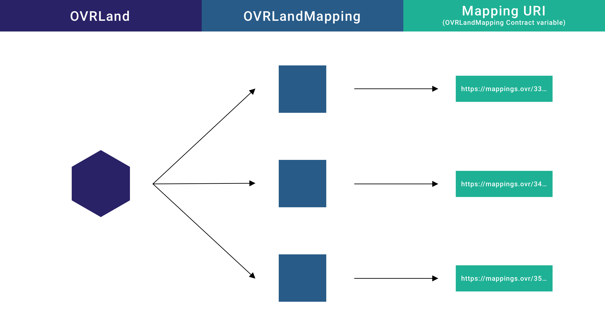
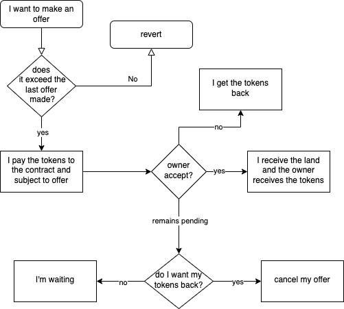
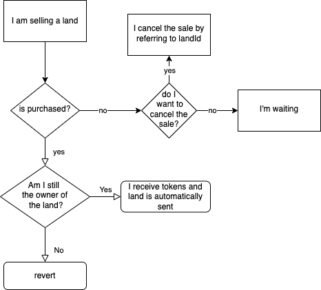
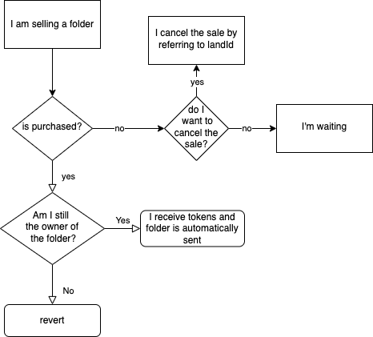
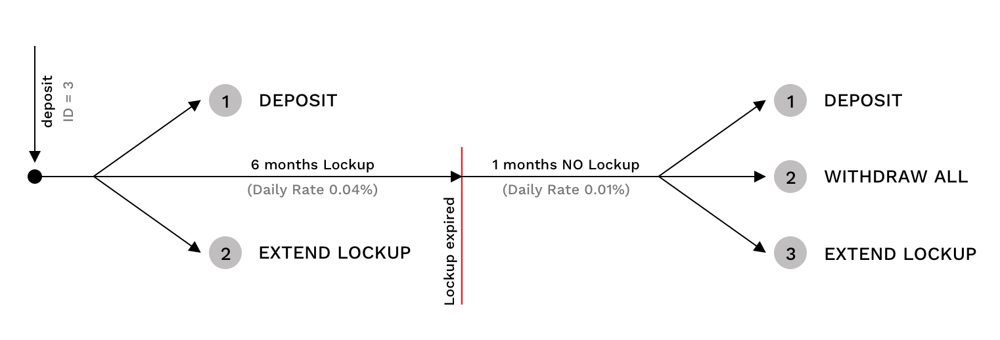

Repository of all smart contracts deployed (and audited) on polygon:

- `OVRLand.sol`
- `LightMint.sol`
- `OVRMarketplace.sol` for only OVRLand

To be deployed:

- `OVRLandContainer.sol` **AUDITED**
- `OVRLandRenting.sol` **AUDITED**
- `OVRLandMapping.sol` **AUDITED**
- `OVRLandExperience.sol` **AUDITED**
- `OVRLandHosting.sol` **AUDITED**
<!-- - `Marketplace.sol` for every ERC721 TODO -->
- `StakingV3.sol`
- `StakingRewards.sol`
- `StakingIPFS.sol`

[Smart Contract Audit](https://assets.ovr.ai/download/documents/OVRLand%20-%20%28Polygon%29%20Smart%20Contract%20Security%20Report.pdf)

## Installation

```js
// clone this project
nvm use
npm install
```

### 🔑 ENV

Create an `.env` file on root. Take a look to `.env.example`

```
PRIVATE_KEY = ""
ETHERSCAN_API_KEY = ""
COINMARKETCAP_API_KEY = ""
ALCHEMY_KEY = ""
MORALIS_KEY = ""
```

# OVRLand

### ➡️ DEPLOY

```
npx hardhat run scripts/deploy.js --network mumbai
```

For production use `matic-mainnet` as network.

### 🔨 MINTING

```js
// REMEBER TO UPDATE OVRLand contractAddress on the top of script
npx hardhat run scripts/batch-mint-lands.js --network testnet
```

### 🔨 MINTING WITH URI

```js
// REMEBER TO UPDATE OVRLand contractAddress on the top of script
npx hardhat run scripts/batch-mint-lands-with-uri.js --network testnet
```

The ERC721 OVRLand contract uses AccessControl from openzeppelin to assign specific roles based on the functions that are called. The roles are:

1. `DEFAULT_ADMIN_ROLE`: May assign or revoke roles.
2. `MINTER_ROLE`: Can perform mint and batchMint
3. `BURNER_ROLE`: It should not be used
4. `LAND_URI_EDITOR_ROLE`: It can modify the URI of the token. This role exists because later a smart contract will be developed that has the ability to change the URI of the experience (metadata) loaded on the land.

# LightMint

Allows users to independently mint lands if they are eligible.

### ➡️ DEPLOY

```
npx hardhat run scripts/deploy-light-mint.js --network testnet
```

For production use `mainnet` as network.

# OVRLandMapping

### ➡️ DEPLOY

```javascript
// Check before deploy
npx hardhat run scripts/deploy-mapping.js --network testnet
```

For production use `mainnet` as network.

NFTs that will be associated with OVRLand, different maps can be associated with each OVRLand.
Variable `mappings`, used to point directly to the map file without having to go through the metadata of the OVRLandMapping token.

```javascript
// OVRLand ID ==> OVRLandMapping ID ==> MAP
mapping(uint256 => mapping(uint256 => string)) public mappings;
```

The metadata of the OVRLandMapping token should include the link to the actual map.



# OVRLandContainer

### ➡️ DEPLOY

```
npx hardhat run scripts/deploy-container.js --network testnet
```

For production use `mainnet` as network.

### ↩️ UPGRADE

```
npx hardhat run scripts/upgrade-container.js --network testnet
```

OVRLandContainer is the token representative of the containers containing OVRLands.

Anyone who has at least 2 lands can create a container by calling the `createContainer` function passing the landId of the lands that the container will contain, lands will be transfered from the caller to the contract, and a OVRLandContainer token will be minted to caller.
This function can be called from the owner of the OVRLand tokens only if lands aren't on selling or on renting inside marketplace contract and renting contract.

The owner of a container can remove or add lands inside the container by calling `addLandToContainer` and `removeLandFromContainer` functions passing the landId to be added/removed and the destination containerId.

The owner of a container can also destroy owned container by calling `deleteContainer` function passing the containerid, it will return to the owner all the lands that were inside the container and will burn the container token.

`addLandToContainer`, `removeLandToContainer` and `deleteContainer` can be called only if the container isn't on selling or on renting inside marketplace contract and renting contract.

Trough the `ownerOfChild` function passing a landId it's possible to see the owner of a land that is inside a container.

Calling the `childsOfParent` function passing a containerId it's possible to see all the lands inside a container.

OVRLandContainer follow the ERC721 standard so there are all the standard functions like `transferFrom`, `transfer`, etc..

# Secondary Marketplace OVRLand

### ➡️ DEPLOY

```
npx hardhat run scripts/deploy-marketplace.js --network testnet
```

For production use `mainnet` as network.

### ↩️ UPGRADE

```
npx hardhat run scripts/upgrade-marketplace.js --network testnet
```

The marketplace has 3 different types of purchase and sale:

- **Offer**: anyone can make offers to buy any land, it will be the owner who decides whether to accept, reject or keep them pending.
- **Direct Sale for Land**: the owner of a land can sell their land and anyone can buy it by paying the amount set by the owner + taxes
- **Direct Sale by Container**: the owner of land can sell containers and anyone can buy them by paying the amount set by the owner + taxes.

## OFFERS

Anyone can bid on an existing land, even if the land are for sale alone or in a container, by calling the function `placeOffer` and pass the landId and the price of the bid multiplied to 1e18, all the tokens bidded will be transfered inside the marketplace contract.

The owner of the land can accept the offer calling the function `acceptOffer` and passing the landId, it will send the fee to the feeReciver, the land to the buyer and the amount to the land owner.



## Direct sale for Land

The owner of a land can put their land up for sale and anyone can buy it by paying the amount set by the owner + taxes, each land can be offered for sale only once at a time, alone or in a container.

The land can be put for sale by calling the function `sell`, passing the landId and the price multiplied to 1e18.

The buyer can buy the land by calling the function `buy` and passing the landId, it will send the fee to the feeReciver, the land to the buyer and the amount to the land owner



## Direct Sale by container

The owner of a container can put the container up for sale and anyone can buy it by paying the amount set by the owner + taxes

The container can be put for sale by calling the function `sellContainer`, passing the containerId and the price multiplied to 1e18.

The buyer can buy the container by calling the function `buyContainer` and passing idContainer, it will send the fee to the feeReciver, the container to the buyer and the amount to the seller.



## `onSelling()` and `onSellingContainer()` modifiers

Will check if anyone the person that put up the land or the container for sale, is the currently owner.

### _why?_

Because lands can be sold outside of our smart contracts.

Without these modifiers someone can sell his lands both on our market and outside, and one of the two buyers would not receive them because the lands have already been sold, instead with these modifiers if the one who is selling the lands is the current owner of the land at the time of purchase means that the land has not been sold or transferred outside of our contract.

---

# Secondary Marketplace Generic ERC721

The generic marketplace works exactly like the one for OVRLand. The main difference is that the functions now require an additional field which is the contract address.

# StakingV3 OVR

The staking contract allows users to deposit OVR and receive rewards in 5 different ways.

| Stake Mode ( depositId ) | 1                                                               | 2        | 3        | 4         | 5         |
| ------------------------ | --------------------------------------------------------------- | -------- | -------- | --------- | --------- |
| Period Lockup            | No Lockup time (I can withdraw capital and rewards at any time) | 3 Months | 6 Months | 9 Months  | 12 Months |
| Daily Interest Rate      | 0.01%                                                           | 0.03%    | 0.04%    | **0.06%** | **0.08%** |
| Gain after 365 days      | 3.7%                                                            | 11.6%    | 15.7%    | 24.5%     | 33.9%     |

To calculate the final balance, the smart contract uses the formula of compound daily interest:


- **A** the future value of the investment
- **C** the principal investment amount
- **r** the daily interest rate (based on depositId)
- **n** the number of days the money is invested for (timestamp / 1 days)

Once the lockup period has been completed after deposit, it is possible to:

1. Make a new deposit.
2. Withdraw the balance previously deposited and related rewards.
3. Extend previous lockup. For example if I deposited in mode 4 (9 months), I can extend the lockup for another 9 months after lookup period expiration.

In this example case below, rewards are calculated for the duration of 6 months with an APY of 15.7%, for the entire duration after the expired lockup the rewards are calculated with minimum APY (3.7%). The total rewards are the sum of:

- 6 months 0.04% Daily Interest Rate
- 1 month 0.01% Daily Interest Rate



```
Example
deposit = 500 OVR
depositId = 3
Daily Interest Rate 0.04%
... 7 months passed (2629743 seconds * 7) ...
Capital_6_months = 500 (1 + 0.04%)^180 => 537.319 OVR
finalCapital = 537.319 (1 + 0.01%)^30) => 538.933 OVR
```

The only transactions allowed during the lockup period are deposit, lockup extension and withdraw rewards.

If another deposit occur during the blocking period, the reference balance will be calculated by adding the final balance generated by the predefined interest rate up to that moment and the new deposit. From then on, new rewards will be generated.

For lockup extension. If you request for a lockup extension during the block period, rewards will be withdrawn with rewards generated up to that moment, and lockup time restart from time 0.

## Withdraw rewards

During the lockup period or after, users can withdraw their rewards, they will go into StakingRewards contract as balance to be spent inside the OVR ecosystem (IPFS Hosting or Primary Market).
If users withdraw their balance, the APY will be of course lower at the end of the lockup 'cause there will not be the compund of the withdrawn rewards.

# OVRLand Renting

Two contracts will exist: `OVRLandExperience` and `OVRLandRenting`.

The first one deals with:

- Keeping track of the URIs of the experiences which will be of 2 types:
  - **URI of the owner**, visible when a rental is not active (this experience could look like a billboard inviting users to rent).
  - **URI of the renter**, visible only within the rental period.
- Keep track of rental periods: in fact OVRLandRenting will have to communicate start timestamp and duration in months. In this way to the call of experienceURI(NFTID), the function will respond with the correct type of URI based on the presence or absence of the rent.

OVRLandRenting deals with managing the offers made by renters. Each offer has a maximum duration of 24 hours, within this time frame it is possible to make other offers, which if considered better will rewrite the previous one (with relative reimbursement of the previous offerer).

- Offers longer than 1 month can only be confirmed by the owner.
- Offers with duration equal to 1 month, can be confirmed by the owner at any time, or by the renter if for 24 hours no one has made a better offer.

Once the renting period has been started, it is not possible to make other offers.

The renter will be able to update the experience as many times as he wants (imagine if the experience doesn't work properly, it must be always possible to change it).

## Features

1. Offer creation (renter)
2. Offer acceptance (owner)
3. Offer cancel (renter)
4. Renting disabling (owner)
5. Experience Update (renter)

Offers can be made if:

- No offers have been made before
- The last offer was made less than 24 hours ago
- The last offer was made more than 7 days ago (this means that the owner is inactive, and the renter is either inactive or has made an offer for more than 1 month, if the owner is inactive offer must be redone for only 1 month)

Each time the renter makes an offer, the amount is already paid to the contract. If a new bid exceeds the previous one, the previous bidder will be refunded.

In case of acceptance, the amount paid by the bidder will be credited to the owner, while the renter will now have the right to apply his experience on the land.

The owner can always update their experience, however it will not be visible if a rental is in progress.

---

# Staking IPFS

The IPFS Staking is needed for all the nodes of the IPFS Network of OVR

Users can deposit only 500k OVR (not less and not more)

The staking has 12 months lockup

Users can start the staking trough `stake()` function

after 12 months users can withdraw their staking trough `withdraw()` function

through `onStaking(address)` function is possible to see if a user have 500k OVR on staking and through `stakingExpiration(address)` is possible to see the expiretion of the staking for a specified user

## 📝 ETHERSCAN VERIFICATION

To try out Etherscan verification, you first need to deploy a contract to an Ethereum network that's supported by Etherscan, such as Ropsten.

In this project, copy the .env.example file to a file named .env, and then edit it to fill in the details. Enter your Etherscan API key, your Ropsten node URL (eg from Alchemy), and the private key of the account which will send the deployment transaction. With a valid .env file in place, first deploy your contract:

```shell
hardhat run --network ropsten scripts/deploy.js
```

Then, copy the deployment address and paste it in to replace `DEPLOYED_CONTRACT_ADDRESS` in this command:

```shell
npx hardhat verify --network ropsten DEPLOYED_CONTRACT_ADDRESS "Hello, Hardhat!"
```

---

## 🟣 Mainnet addresses

- ### OVRLand: [0x93c46aa4ddfd0413d95d0ef3c478982997ce9861](https://polygonscan.com/address/0x93c46aa4ddfd0413d95d0ef3c478982997ce9861)
- ### OVRMarketplace Proxy:[0x7e98b560efa48d8d04292eaf680e693f6eefb534](https://polygonscan.com/address/0x7e98b560efa48d8d04292eaf680e693f6eefb534)
- ### OVRMarketplace Implementation: [0xf5c99b5936b34aa5f228d558d8589c3de54f8106](https://polygonscan.com/address/0xf5c99b5936b34aa5f228d558d8589c3de54f8106)

### Testnet addresses

- OVRLand: 0x771468b89d8218d7f9b329DFbf4492320Ce28b8d
- OVRLand Container: 0x1a5006044D89e73919239e7dc3455cF5512CBC27
- OVRMarketplace: 0x54b461C78B88c498989551Be6ef5e3b8F4f8d123

---
